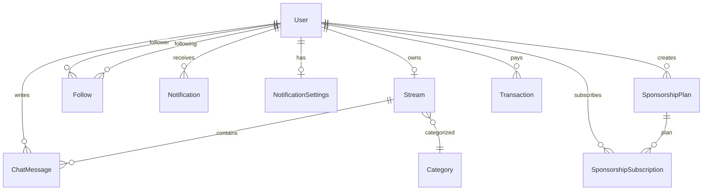

# Data Model

Источник истины: [`prisma/schema.prisma`](../../prisma/schema.prisma).

## Entity Relationship (core)



## Key Models

| Model | Table | Notes |
|-------|-------|-------|
| `User` | `users` | Channel = user with `stream`; `telegramId` mapped as `teleram_id` *(typo in DB)* |
| `Stream` | `streams` | 1:1 with user; LiveKit `ingressId`, `isLive` |
| `ChatMessage` | `chat_messages` | Per-stream messages |
| `Follow` | `follows` | Unique `[followerId, followingId]` |
| `SponsorshipPlan` | `sposorship_plans` | Table name typo preserved |
| `Transaction` | `transactions` | Stripe-linked payments |
| `Token` | `tokens` | EMAIL_VERIFY, PASSWORD_RESET, etc. |

## Enums

- `TokenType`: `EMAIL_VERIFY`, `PASSWORD_RESET`, `DEACTIVATE_ACCOUNT`, `TELEGRAM_AUTH`
- `NotificationType`: `STREAM_START`, `NEW_FOLLOWER`, `NEW_SPONSORSHIP`, `ENABLE_TWO_FACTOR`, `VERIFIED_CHANNEL`
- `TransactionStatus`: `PENDING`, `SUCCESS`, `FAILED`, `EXPIRES`

## Prisma Client

- Generated output: `prisma/generated/`
- Custom import aliases: `@/prisma/generated/*`, `@prisma/generated`
- Adapter: `PrismaPg` (PostgreSQL only in runtime)

## Migrations

```bash
npx prisma migrate deploy   # production
npx prisma migrate dev      # local new migration
npx prisma generate
```

> **Gap:** нет автоматического CI step для миграций — см. [../deployment/production.md](../deployment/production.md).

## Seed

`yarn db:seed` → [`src/core/prisma/prisma.seed.ts`](../../src/core/prisma/prisma.seed.ts) — users, categories, streams demo data.
