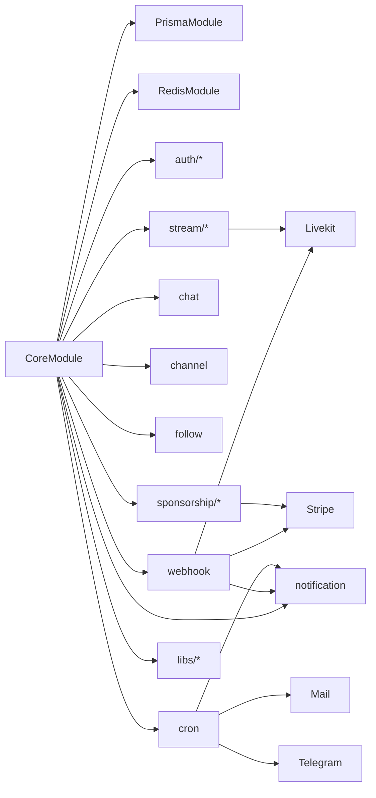

# Module Map

Все feature-модули регистрируются в [`CoreModule`](../../src/core/core.module.ts).

## Dependency Graph (упрощённо)

## Module Registry

| Module | Path | README |
|--------|------|--------|
| Core (infra) | `src/core/` | [README](../../src/core/README.md) |
| Auth | `src/modules/auth/` | [README](../../src/modules/auth/README.md) |
| Stream + Ingress | `src/modules/stream/` | [README](../../src/modules/stream/README.md) |
| Chat | `src/modules/chat/` | [README](../../src/modules/chat/README.md) |
| Channel | `src/modules/channel/` | [README](../../src/modules/channel/README.md) |
| Category | `src/modules/category/` | [README](../../src/modules/category/README.md) |
| Follow | `src/modules/follow/` | [README](../../src/modules/follow/README.md) |
| Notification | `src/modules/notification/` | [README](../../src/modules/notification/README.md) |
| Sponsorship | `src/modules/sponsorship/` | [README](../../src/modules/sponsorship/README.md) |
| Webhook | `src/modules/webhook/` | [README](../../src/modules/webhook/README.md) |
| Cron | `src/modules/cron/` | [README](../../src/modules/cron/README.md) |
| Libs (integrations) | `src/modules/libs/` | [README](../../src/modules/libs/README.md) |

## Auth Submodules

| Submodule | Responsibility |
|-----------|----------------|
| `account` | CRUD user, change email/password |
| `session` | Login, logout, sessions list |
| `profile` | Avatar, bio, social links |
| `verification` | Email verify tokens |
| `password-recovery` | Reset password flow |
| `totp` | 2FA enable/disable |
| `deactivate` | Account deactivation |

## Sponsorship Submodules

| Submodule | Responsibility |
|-----------|----------------|
| `plan` | Creator sponsorship tiers (Stripe products) |
| `subscription` | Active sponsors |
| `transaction` | Checkout sessions, payment history |

## Shared (`src/shared/`)

- `guards/gql-auth.guard.ts` — session check
- `decorators/` — `@Authorization()`, `@Authorized()`, `@UserAgent()`
- `utils/` — session destroy, ms parse, token generation
