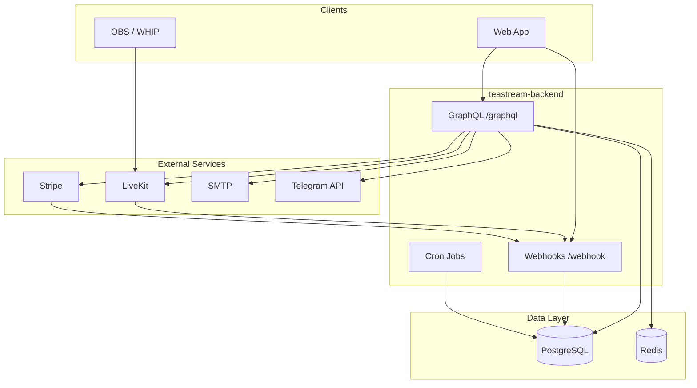

# Architecture Overview

## Project Type

**Single deployable backend** — NestJS 11 monolith (`teastream-backend`), не monorepo с несколькими репозиториями.

> **Assumption:** фронтенд и другие сервисы Teastream живут в отдельных репозиториях; этот репозиторий — только API/backend.

## Technology Stack

| Layer | Technology |
|-------|------------|
| Runtime | Node.js, TypeScript 5.7 |
| Framework | NestJS 11 |
| API | GraphQL (Apollo) + REST webhooks |
| ORM | Prisma 7 + `@prisma/adapter-pg` |
| Database | PostgreSQL 15 |
| Cache / Sessions | Redis 5 (`connect-redis`) |
| Auth | express-session + cookie, TOTP (otpauth) |
| Streaming | LiveKit Server SDK |
| Payments | Stripe |
| Email | `@nestjs-modules/mailer` + React Email templates |
| Bot | Telegraf (`nestjs-telegraf`) |
| Scheduler | `@nestjs/schedule` |
| Password hashing | argon2 |

## High-Level Diagram

## Architectural Patterns

1. **Modular monolith** — домены в `src/modules/*`, общая инфраструктура в `src/core/`.
2. **GraphQL-first** — бизнес-операции через resolvers; исключение — webhooks (raw HTTP).
3. **Session-based auth** — `userId` в Redis-backed session; `GqlAuthGuard` + `@Authorization()`.
4. **Code-first GraphQL** — схема генерируется в `src/core/graphql/shema.gql`.
5. **Integration adapters** — `src/modules/libs/*` инкапсулируют внешние SDK.

## Entry Points

| File | Role |
|------|------|
| `src/main.ts` | Bootstrap: cookies, session, CORS, validation pipe |
| `src/core/core.module.ts` | Root module, imports all features |
| `src/bootstrap-paths.ts` | Path aliases для production (`dist/`) |

## Related Docs

- [modules.md](modules.md)
- [data-model.md](data-model.md)
- [integrations.md](integrations.md)
- [sequences.md](sequences.md)
