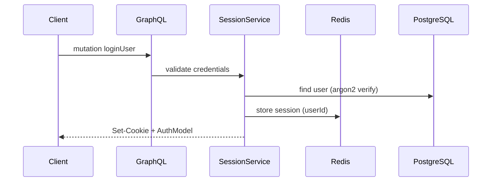
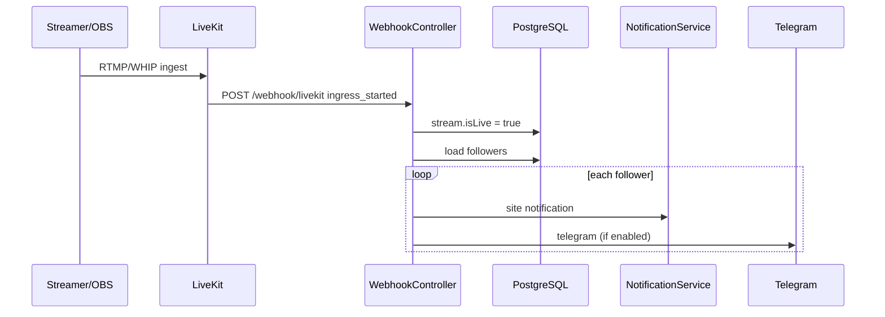
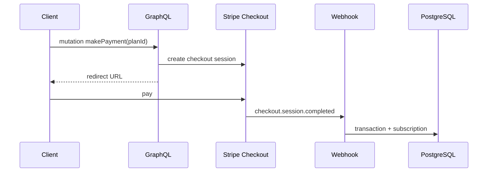
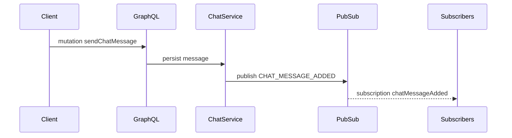

# Sequence Diagrams

## Login (Session)

## Go Live (LiveKit)

## Sponsorship Payment

## Chat Message (Realtime)

> **Note:** PubSub in-memory (`graphql-subscriptions`) — не масштабируется на несколько инстансов без Redis PubSub adapter *(architectural gap)*.
