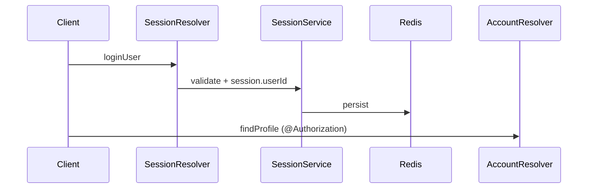

# Auth Domain

## Overview

Домен аутентификации и управления аккаунтом: регистрация, сессии, профиль, email-верификация, восстановление пароля, TOTP 2FA, деактивация.

## Responsibilities

| Submodule | Responsibility |
|-----------|----------------|
| `account` | User creation, email/password change |
| `session` | Login, logout, session listing, metadata (IP, device, geo) |
| `profile` | Display name, bio, avatar, social links |
| `verification` | Email verification tokens |
| `password-recovery` | Reset password email + token |
| `totp` | 2FA QR, enable/disable |
| `deactivate` | Soft deactivate → cron hard delete |

## Architecture

- **Auth mechanism:** Redis-backed `express-session`, `userId` on session
- **Password:** argon2 hashing
- **Guards:** `@Authorization()` → `GqlAuthGuard` in `src/shared/guards/`

## Directory Structure

```
auth/
├── account/
├── session/
├── profile/
├── verification/
├── password-recovery/
├── totp/
└── deactivate/
```

## Environment Variables

| Variable | Purpose |
|----------|---------|
| `SESSION_*`, `COOKIE_SECRET` | Sessions (see main.ts) |
| `MAIL_*` | Verification & recovery emails |
| `ALLOWED_ORIGIN` | Links in emails |
| `REDIS_URI` | Session storage |

## Local Development

Test via GraphQL Playground with credentials:

```graphql
mutation { loginUser(data: { login: "user@mail.com", password: "..." }) { user { id } } }
```

## Build & Run

Part of `yarn start:dev` — no separate process.

## API Overview

| Type | Operations |
|------|------------|
| Mutation | `createUser`, `loginUser`, `logoutUser`, `changePassword`, `enableTotp`, `deactivateAccount`, ... |
| Query | `findProfile`, `findSessionsByUser`, `findCurrentSession`, `generateTotpSecret` |

Full schema: [`src/core/graphql/shema.gql`](../../core/graphql/shema.gql)

## Integrations

- **Mail** — verification, password recovery, 2FA reminders
- **Redis** — sessions
- **Prisma** — `User`, `Token`

## Dependencies

- `PrismaService`, `RedisService`, `MailService`
- `NotificationService` (2FA notifications via cron)

## Sequence



## Observability

- Session metadata uses `geoip-lite`, `device-detector-js`
- Errors: `UnauthorizedException` (RU messages)

## Troubleshooting

| Issue | Fix |
|-------|-----|
| Playground logout breaks login | Enable credentials in playground settings |
| TOTP login fails | Pass `pin` in `LoginInput` |
| Email not sent | Check `MAIL_*` env |

## Known Issues

- `UserModel` exposes `password` field in GraphQL schema
- DB column typo `teleram_id` for `telegramId`

## Scaling Notes

Session keys in Redis — ensure shared Redis for multi-instance.

## Related

- [docs/security/auth-sessions.md](../../../docs/security/auth-sessions.md)
- [../notification/README.md](../notification/README.md)
- [../cron/README.md](../cron/README.md)
